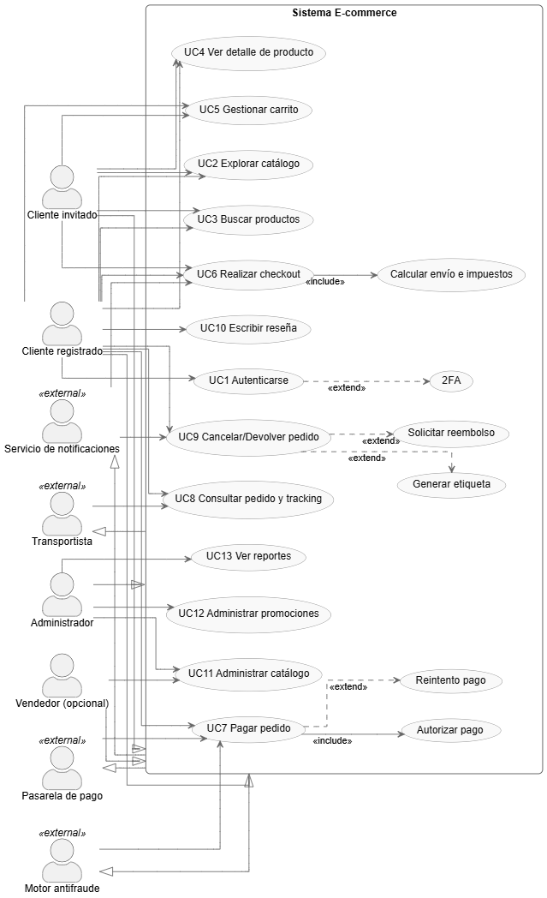

# Tarea #2 — Identificar requerimientos (Sitio e-commerce)
**Curso:** Análisis y Diseño de Sistemas 1  
**Alumno:** _Fernando José Vicente Velásquez_  
**Fecha:** _05/09/2025_  

## 1) Actores
- **Cliente invitado**: navega, busca productos, añade al carrito.
- **Cliente registrado**: todo lo del invitado + compra, historial, devoluciones, reseñas.
- **Administrador**: gestiona catálogo, precios, promociones, pedidos, usuarios.
- **Vendedor/Marketplace (opcional)**: publica y gestiona su inventario.
- **Pasarela de pago** (actor externo): autoriza y captura pagos.
- **Transportista** (actor externo): recolecta/envía pedidos y reporta tracking.
- **Servicio de notificaciones** (actor externo): email/SMS/WhatsApp para confirmaciones.
- **Motor antifraude** (actor externo): evalúa riesgo de la transacción.

## 2) Requerimientos funcionales (RF)
RF1. **Registro y autenticación** de usuarios (email/contraseña, SSO opcional).  
RF2. **Recuperación de contraseña** y 2FA opcional.  
RF3. **Gestión de perfil**: datos personales, direcciones, métodos de pago guardados.  
RF4. **Catálogo**: listar, filtrar, ordenar y paginar productos.  
RF5. **Búsqueda** con autocompletar y sinónimos.  
RF6. **Ficha de producto**: imágenes, precio, variantes (talla/color), stock, reseñas.  
RF7. **Carrito de compras**: agregar, editar cantidades, eliminar, cupones.  
RF8. **Checkout**: dirección, método de envío, impuestos, resumen de costos.  
RF9. **Pago**: integración con pasarela (autorización, captura, reintentos).  
RF10. **Órdenes**: creación, confirmación, número de pedido y recibo.  
RF11. **Tracking**: integración con transportista y visualización de estado.  
RF12. **Cancelación/Devolución**: políticas, generación de etiqueta y reembolsos.  
RF13. **Reseñas y calificaciones** con moderación.  
RF14. **Wishlist** (lista de deseos) y alertas de precio/stock.  
RF15. **Promociones**: cupones, descuentos por volumen, cross-sell/upsell.  
RF16. **Gestión de inventario**: control de stock, alertas, backorders.  
RF17. **Backoffice administrador**: CRUD de productos/categorías, precios, medios.  
RF18. **Reportes**: ventas, productos top, conversión, abandono de carrito.  
RF19. **Notificaciones**: confirmaciones de pedido, envío, entrega, incidencias.  
RF20. **Soporte**: tickets, chat o formulario de contacto.

## 3) Requerimientos no funcionales (RNF)
- **Rendimiento:** TTFB ≤ 500 ms en páginas clave; búsqueda < 1 s bajo carga típica.  
- **Escalabilidad:** horizontal (web, caché, cola) para picos del doble del tráfico medio.  
- **Disponibilidad:** ≥ 99.9% mensual; degradación controlada si falla un microservicio.  
- **Seguridad:** OWASP Top 10, PCI-DSS en manejo de pagos, cifrado TLS 1.2+; hash de contraseñas con bcrypt/argon2.  
- **Privacidad:** cumplimiento de leyes locales; consentimiento de cookies y políticas claras.  
- **Usabilidad:** navegación consistente; 3 clics a compra desde el catálogo.  
- **Accesibilidad:** WCAG 2.1 AA (texto alternativo, foco, contraste).  
- **Confiabilidad:** colas/idempotencia en pagos y órdenes; retry con backoff.  
- **Observabilidad:** logs estructurados, métricas (APM), trazabilidad distribuida.  
- **Mantenibilidad:** cobertura de pruebas ≥ 75%; estándares de código y CI/CD.  
- **Portabilidad:** contenedores; despliegue en nubes compatibles.  
- **Localización:** soporte multi-moneda, formateo regional y traducciones.

## 4) Casos de uso (principales)
- **UC1 Autenticarse** (incluye “Recuperar contraseña”; extiende “2FA”).  
- **UC2 Explorar catálogo** (incluye “Filtrar/Ordenar”).  
- **UC3 Buscar productos** (incluye “Autocompletar”).  
- **UC4 Ver detalle de producto** (incluye “Ver reseñas”).  
- **UC5 Gestionar carrito** (agregar/editar/eliminar; incluye “Aplicar cupón”).  
- **UC6 Realizar checkout** (incluye “Calcular envío e impuestos”).  
- **UC7 Pagar pedido** (incluye “Autorizar pago”; extiende “Reintento pago”).  
- **UC8 Consultar pedido y tracking**.  
- **UC9 Cancelar/Devolver pedido** (extiende “Generar etiqueta” y “Solicitar reembolso”).  
- **UC10 Escribir reseña**.  
- **UC11 Administrar catálogo** (Admin).  
- **UC12 Administrar promociones** (Admin).  
- **UC13 Ver reportes** (Admin).

## 5) Diagrama UML

Se utilizó la extensión PlantUML para generar el diagrama, usando el código en 
[casos_uso_refinado.puml](casos_uso_refinado.puml).
